# hs_datastructure_BST

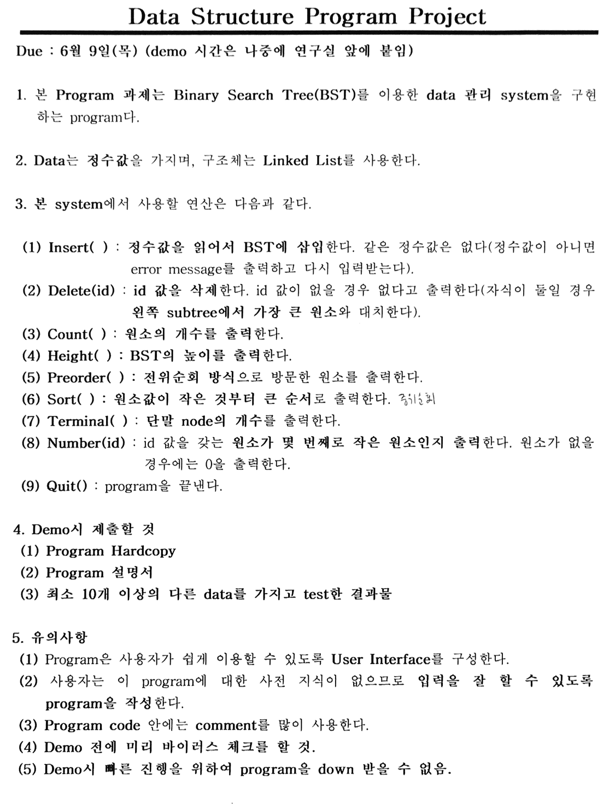

Program 설명서

프로그램 실행시 콘솔에 밑에 그림과 같이 출력이 된다.

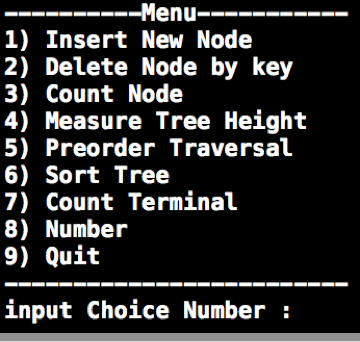

입력은 1 ~ 9 까지의 숫자를 입력 받으며 다른 입력을 할시 밑에 와 같이 오류 메세지가 출력되며 다시 입력 받는다.
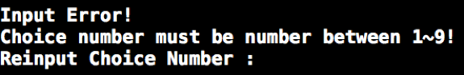

1) Insert New Node 옵션은 키를 입력받아 새로운 노드를 생성후 BST의 알맞은 위치에 배치된다.
입력받을시 메뉴와 마찬가지로 정수값이 아니면 밑과 같이 에러메세지를 출력후 다시 입력받는다.
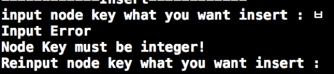

2) Delete Node by key옵션은 키를 입력받아 키값에 해당하는 노드를 찾아 삭제를 하며 해당 하는 노드가 터미널 노드인 경우 자식이 하나만 있는경우 자식을 모두 갖고 있는 경우를 나누어 프로그래밍 된다. 트리가 비어있는경우와 해당하는 키값을 가진 노드가 없을경우 밑과 같은 에러 메세지를 출력한다.

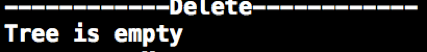

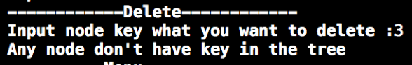

3) Count Node 옵션은 node 의 갯수를 출력하는 메뉴이며 밑과 같이 출력된다.

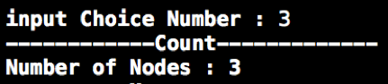

4) Measure Tree Height 옵션은 트리에 높이를 출력하는 메뉴이며 트리를 전부 순회하며 터미널 노드중 가장 갚은 노드를 기준으로 밑과 같이 출력된다.

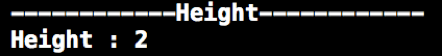

5) Preorder Traversal 옵션은 생성된 트리를 전위 순회하여 노드의 키 값을 출력하는 메뉴이며 밑 그림 과 같이 출력된다.

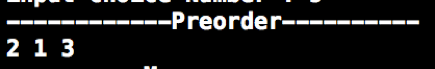

6) Sort Tree옵션은 Tree의 노드 값을 기준으로 작은 값 순으로 출력 시키는 함수이며 중위 순회를 하며 밑의 그림과 같이 출력됩니다.

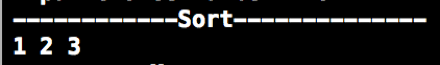

7) Count Terminal 옵션은 Tree의 Terminal Node의 갯수를 출력하는 메뉴이며, 트리를 순회하며 자식이 없는 노드의 갯수를 카운트하여 밑의 그림과 같이 출력합니다.

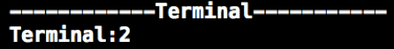

8) Number 옵션은 키값을 입력 받아 해당하는 키 값을 가진 노드가 몇 번째로 작은 노드인지를 출력하며
입력받은 키값을 가진 노드가 없으면 밑의 그림과 같이 출력됩니다.

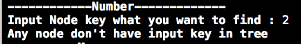

9) quit 옵션은 프로그램을 종료 시키는 메뉴입니다.

결과물
50 20 8 13 88 101 10 66 30 87 3 78 24 순으로 13개의 데이터를 입력하여 테스트한 결과 입니다.
3) Count Node 메뉴

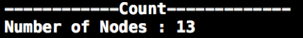

4) Measure Tree Height 메뉴

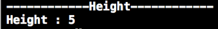

5)Preorder Traversal 메뉴

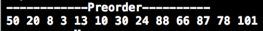

6) Sort Tree 메뉴

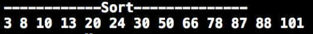

7)Count Treminal 메뉴

8) Number 메뉴

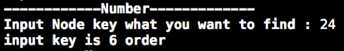
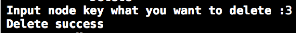
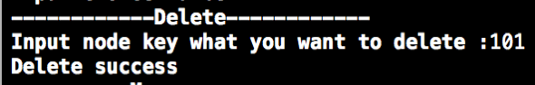

위 상태에서 20 101 3 순으로 데이터를 지우고 테스트한 결과 입니다.

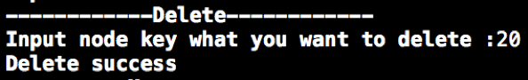

3) Count Node 메뉴

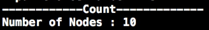

4) Measure Tree Height 메뉴

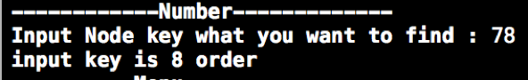

5) Preorder Traversal 메뉴

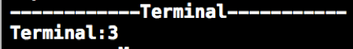

6) Sort Tree 메뉴

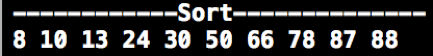

7)Count Treminal 메뉴

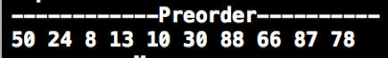

