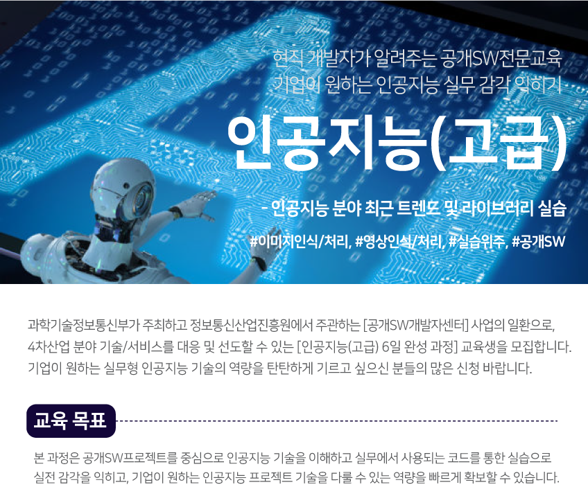

# AI-High_Level

### Period: 2019.12.02 - 2019.12.07, 19:00 - 20:00

|차시|주제|
|---|:---:|
|`1차시`|인공 신경망과 Backpropagation에 대한 이해와 구현|
|`2차시`|딥러닝 프로젝트와 딥러닝 프레임워크|
|`3차시`|이미지 데이터와 CNN에 대한 이해와 구현|
|`4차시`|딥러닝 프레임워크를 이용한 CNN 프로젝트|
|`5차시`|CNN 구조의 개선|
|`6차시`|딥러닝 프로젝트 실습 - DCGAN|